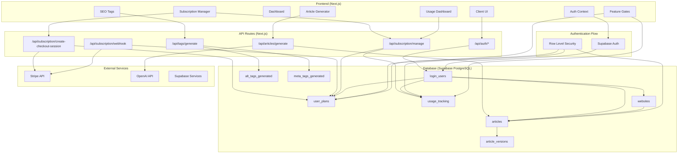
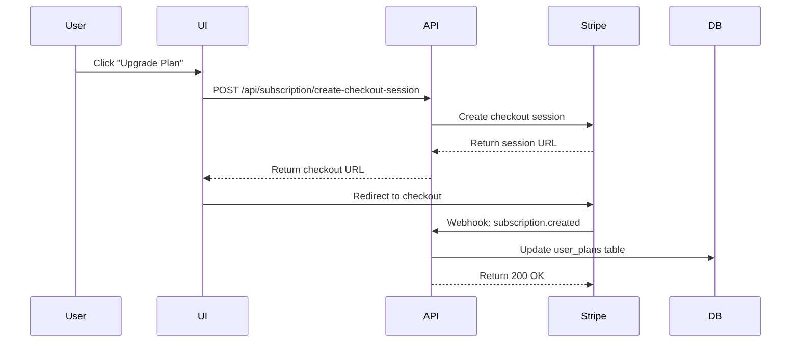
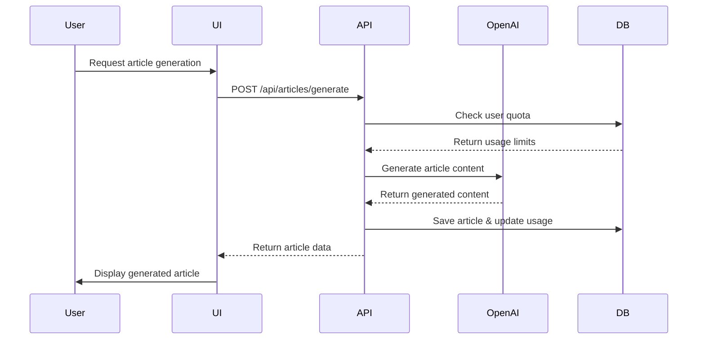
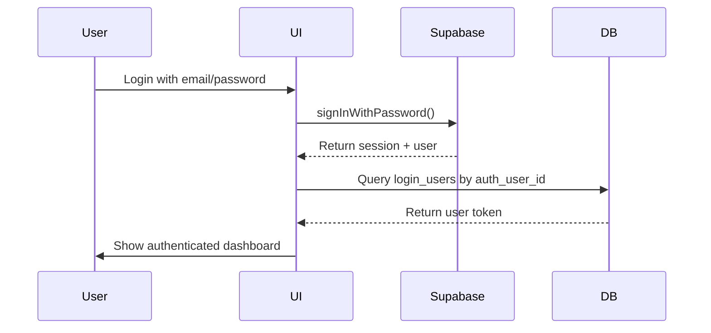

# 📊 SEOMetrics.ai System Architecture

## System Architecture Overview

This document contains the complete system architecture for SEOMetrics.ai, including all components, data flows, and integrations.

## Component Details

### Frontend Components (Next.js + TypeScript)

#### Core UI Components
- **Client UI**: Main application interface with responsive design
- **Auth Context**: Manages user authentication state and token handling
- **Dashboard**: Central hub showing user's websites and activity
- **Subscription Manager**: Handles plan upgrades, billing, and subscription status
- **Usage Dashboard**: Displays current usage vs. plan limits with progress bars
- **Article Generator**: Interface for creating SEO-optimized articles
- **SEO Tags Generator**: Tools for generating alt-tags and meta-tags
- **Feature Gates**: Components that restrict access based on subscription tier

#### State Management
- React Context for authentication
- Local component state for UI interactions
- Custom hooks for feature access (`useFeatures`)

### API Routes (Next.js Server-Side)

#### Subscription Management
- **`/api/subscription/create-checkout-session`**: Creates Stripe checkout sessions for plan upgrades
- **`/api/subscription/webhook`**: Handles Stripe webhook events for subscription changes
- **`/api/subscription/manage`**: Retrieves subscription data, usage stats, and handles plan modifications

#### Content Generation
- **`/api/articles/generate`**: Creates SEO-optimized articles using OpenAI
- **`/api/tags/generate`**: Generates alt-tags and meta-tags for images/pages

#### Authentication
- **`/api/auth/*`**: Proxy routes for Supabase authentication

### Database Schema (Supabase PostgreSQL)

#### User Management
- **`login_users`**: User profiles with auth integration
- **`user_plans`**: Subscription tiers, limits, and Stripe integration
- **`usage_tracking`**: Monthly usage counters by resource type

#### Content Management  
- **`websites`**: User's connected websites
- **`articles`**: Generated articles with metadata and status
- **`article_versions`**: Version history for article edits
- **`alt_tags_generated`**: Generated alt-text for images
- **`meta_tags_generated`**: Generated meta descriptions and titles

### External Services Integration

#### Stripe Payment Processing
- **Products**: Starter ($49), Pro ($139), Enterprise (custom)
- **Webhooks**: Handle subscription lifecycle events
- **Customer Portal**: Self-service billing management

#### OpenAI Content Generation
- **GPT-4**: Article generation with SEO optimization
- **Content Types**: Blog posts, meta descriptions, alt-text

#### Supabase Infrastructure
- **Authentication**: JWT-based auth with social providers
- **Database**: PostgreSQL with Row Level Security
- **Storage**: File uploads and media management
- **Edge Functions**: Serverless compute (future use)

## Data Flow Diagrams

### Subscription Flow

### Article Generation Flow

### Authentication Flow

## Security Architecture

### Row Level Security (RLS) Policies
- **User Plans**: Users can only access their own subscription data
- **Usage Tracking**: Users can only view/modify their own usage records
- **Articles**: Users can only access articles they created
- **Service Role**: API routes use service role key for admin operations

### API Security
- **JWT Authentication**: All API routes require valid Supabase JWT
- **Rate Limiting**: Prevent abuse of generation endpoints
- **Input Validation**: Sanitize all user inputs
- **Environment Variables**: Secure storage of API keys and secrets

## Deployment Architecture

### Vercel Deployment
- **Frontend**: Next.js app with SSR/SSG
- **API Routes**: Serverless functions
- **Environment**: Production, Preview, Development branches

### External Dependencies
- **Supabase**: Database, Auth, Storage (hosted)
- **Stripe**: Payment processing (SaaS)
- **OpenAI**: Content generation (API)
- **Vercel**: Hosting and deployment (SaaS)

## Performance Considerations

### Caching Strategy
- **Static Generation**: Pre-built pages where possible
- **API Caching**: Cache subscription data for short periods
- **Database Indexes**: Optimized queries for user lookups

### Monitoring
- **Error Tracking**: Integration with error monitoring service
- **Performance Metrics**: API response times and database query performance
- **Usage Analytics**: Track feature usage and user engagement

---

## Architecture Maintenance Rules

**CRITICAL: When updating this document:**

1. **Mermaid Syntax**: Use only alphanumeric and underscore characters in node IDs
2. **Component Changes**: Update both diagram and component details section
3. **Database Changes**: Reflect schema updates in database subgraph
4. **API Changes**: Add new routes to API Routes section
5. **Integration Changes**: Update External Services section

**Always update when:**
- Adding new database tables or major schema changes
- Creating new API endpoints or Edge Functions  
- Integrating new external services
- Modifying authentication or authorization
- Adding major UI components
- Changing deployment infrastructure

This architecture document serves as the single source of truth for system design decisions.