# SEOMetrics.ai System Architecture

## System Overview
This document contains the comprehensive architecture diagram for SEOMetrics.ai, showing all components, data flows, and integrations.

## Architecture Diagram

```mermaid
graph TB
    %% Frontend & UI Layer
    subgraph "Frontend (Next.js 14)"
        LP[Landing Page]
        AUTH[Auth Pages]
        DASH[Dashboard]
        SETTINGS[Account Settings] 
        WEBSITES[Website Management]
        ARTICLES[Article Writer]
        KEYWORDS[Keywords Tool]
        SEO_DEBUG[SEO Debug Tool]
    end

    %% Authentication & State Management
    subgraph "Client State"
        AUTHCTX[Auth Context]
        PROTECTED[Protected Routes]
        LOADING[Loading States]
    end

    %% API Layer
    subgraph "Next.js API Routes"
        SUB_CREATE["/api/subscription/create-checkout-session"]
        SUB_MANAGE["/api/subscription/manage"]
        SUB_WEBHOOK["/api/subscription/webhook"]
    end

    %% Edge Functions
    subgraph "Supabase Edge Functions"
        GEN_ARTICLE[generate-article]
        GEN_ALT[generate-image-alt]
        GEN_META[generate-meta-tags]
        GET_ALT[get-alt-tags]
        GET_META[get-meta-tags]
        WEBSITES_FUNC[websites]
    end

    %% Database Layer
    subgraph "Supabase PostgreSQL Database"
        subgraph "Core Tables"
            LOGIN_USERS[(login_users)]
            WEBSITES_TBL[(websites)]
            ARTICLES_TBL[(articles)]
            PAGES[(pages)]
            IMAGES[(images)]
        end
        
        subgraph "Tag Tables"
            ALT_TAGS[(alt_tags)]
            META_TAGS[(meta_tags)]
        end
        
        subgraph "Subscription Tables"
            USER_PLANS[(user_plans)]
            USAGE_TRACKING[(usage_tracking)]
            ARTICLE_VERSIONS[(article_versions)]
        end
        
        subgraph "Legacy/Tracking"
            API_USAGE[(api_usage)]
        end
    end

    %% External Services
    subgraph "External Services"
        STRIPE[Stripe API]
        OPENAI[OpenAI API]
        SUPABASE_AUTH[Supabase Auth]
    end

    %% Deployment & Infrastructure
    subgraph "Deployment (Vercel)"
        VERCEL[Vercel Platform]
        ENV[Environment Variables]
        STATIC[Static Assets]
        SMART_JS[Smart.js Tracking]
    end

    %% Legacy PHP System
    subgraph "Legacy PHP System (Transitioning)"
        PHP_API[PHP APIs]
        PHP_AUTH[PHP Auth System]
        PHP_DB[MySQL Database]
    end

    %% Client Interactions
    LP --> AUTHCTX
    AUTH --> SUPABASE_AUTH
    DASH --> PROTECTED
    SETTINGS --> SUB_MANAGE
    WEBSITES --> WEBSITES_FUNC
    ARTICLES --> GEN_ARTICLE
    
    %% Authentication Flow
    AUTHCTX --> SUPABASE_AUTH
    PROTECTED --> LOGIN_USERS
    LOADING --> AUTHCTX

    %% API Route Interactions
    SUB_CREATE --> STRIPE
    SUB_MANAGE --> STRIPE
    SUB_WEBHOOK --> STRIPE
    SUB_CREATE --> USER_PLANS
    SUB_MANAGE --> USER_PLANS
    SUB_WEBHOOK --> USER_PLANS

    %% Edge Function Interactions
    GEN_ARTICLE --> OPENAI
    GEN_ARTICLE --> ARTICLES_TBL
    GEN_ARTICLE --> USAGE_TRACKING
    GEN_ARTICLE --> USER_PLANS
    
    GEN_ALT --> OPENAI
    GEN_ALT --> ALT_TAGS
    
    GEN_META --> OPENAI
    GEN_META --> META_TAGS
    
    GET_ALT --> ALT_TAGS
    GET_META --> META_TAGS
    WEBSITES_FUNC --> WEBSITES_TBL

    %% Database Relationships
    LOGIN_USERS --> WEBSITES_TBL
    LOGIN_USERS --> ARTICLES_TBL
    LOGIN_USERS --> USER_PLANS
    LOGIN_USERS --> USAGE_TRACKING
    
    WEBSITES_TBL --> ALT_TAGS
    WEBSITES_TBL --> META_TAGS
    WEBSITES_TBL --> PAGES
    WEBSITES_TBL --> IMAGES
    WEBSITES_TBL --> USAGE_TRACKING
    
    ARTICLES_TBL --> ARTICLE_VERSIONS
    ARTICLES_TBL --> WEBSITES_TBL

    %% External Service Integration
    STRIPE --> SUB_WEBHOOK
    
    %% Deployment
    VERCEL --> ENV
    VERCEL --> STATIC
    VERCEL --> SMART_JS
    
    %% Legacy Connections (Being Phased Out)
    PHP_API -.-> PHP_DB
    PHP_AUTH -.-> PHP_DB

    %% Styling
    classDef frontend fill:#e1f5fe
    classDef api fill:#f3e5f5
    classDef database fill:#e8f5e8
    classDef external fill:#fff3e0
    classDef legacy fill:#ffebee
    classDef deployment fill:#f1f8e9

    class LP,AUTH,DASH,SETTINGS,WEBSITES,ARTICLES,KEYWORDS,SEO_DEBUG,AUTHCTX,PROTECTED,LOADING frontend
    class SUB_CREATE,SUB_MANAGE,SUB_WEBHOOK,GEN_ARTICLE,GEN_ALT,GEN_META,GET_ALT,GET_META,WEBSITES_FUNC api
    class LOGIN_USERS,WEBSITES_TBL,ARTICLES_TBL,PAGES,IMAGES,ALT_TAGS,META_TAGS,USER_PLANS,USAGE_TRACKING,ARTICLE_VERSIONS,API_USAGE database
    class STRIPE,OPENAI,SUPABASE_AUTH external
    class PHP_API,PHP_AUTH,PHP_DB legacy
    class VERCEL,ENV,STATIC,SMART_JS deployment
```

## Component Details

### Frontend Components (Next.js 14)
- **Landing Page**: Public marketing site with feature showcase
- **Auth Pages**: Login/register using Supabase Auth
- **Dashboard**: Main user interface with website overview
- **Account Settings**: Subscription management and user preferences
- **Website Management**: Add, configure, and manage tracked websites
- **Article Writer**: AI-powered content generation tool
- **Keywords Tool**: SEO keyword research and analysis
- **SEO Debug Tool**: Website SEO analysis and recommendations

### API Routes
- **Subscription Routes**: Stripe integration for billing management
  - `create-checkout-session`: Initiates Stripe checkout
  - `manage`: Handle subscription changes (cancel/reactivate)
  - `webhook`: Process Stripe webhook events

### Supabase Edge Functions
- **generate-article**: OpenAI-powered article generation with quota checks
- **generate-image-alt**: AI-generated alt-text for images
- **generate-meta-tags**: AI-generated meta titles and descriptions
- **get-alt-tags**: Retrieve alt-tags for a website
- **get-meta-tags**: Retrieve meta-tags for a website
- **websites**: Website management operations

### Database Schema

#### Core Tables
- **login_users**: User accounts with tokens and basic info
- **websites**: Tracked websites with settings and tokens
- **articles**: Generated articles with content and metadata
- **pages**: Website pages for meta-tag processing
- **images**: Website images for alt-text processing

#### Tag Tables
- **alt_tags**: Generated image alt-text storage
- **meta_tags**: Generated meta titles and descriptions

#### Subscription System
- **user_plans**: User subscription tiers and limits
- **usage_tracking**: Monthly quota usage by user/resource
- **article_versions**: Version history for generated articles

### External Integrations
- **Stripe**: Payment processing and subscription management
- **OpenAI**: AI content generation (GPT-4 and GPT-3.5)
- **Supabase Auth**: User authentication and session management

### Deployment (Vercel)
- **Static Assets**: Next.js optimized builds
- **Environment Variables**: Configuration management
- **Smart.js**: Analytics tracking script
- **Edge Functions**: Serverless function deployment

### Data Flow

#### Article Generation Flow
1. User requests article generation
2. System checks quota against user_plans
3. If allowed, calls OpenAI API
4. Saves article to database
5. Updates usage_tracking
6. Returns article to user

#### Subscription Flow
1. User clicks upgrade
2. Creates Stripe checkout session
3. User completes payment
4. Stripe webhook updates user_plans
5. New quotas become available

#### SEO Tag Generation Flow
1. Website registered with tracking token
2. Smart.js detects images/pages
3. Edge functions generate AI tags
4. Tags stored in alt_tags/meta_tags tables
5. Tags served via API endpoints

## Security Features
- Row Level Security (RLS) on all tables including subscription tables
- User token-based access control with auth.uid() validation
- Service role policies for Stripe webhooks and Edge Functions
- Stripe webhook signature verification
- Environment variable protection
- CORS headers on Edge Functions
- Auto-creation of default user plans for new accounts

## Monitoring & Analytics
- Usage tracking for quota management
- Smart.js for website analytics
- Stripe payment monitoring
- Error logging in Edge Functions

## Legacy System
The PHP system is being phased out in favor of the Next.js/Supabase architecture. Some endpoints may still reference legacy components during transition.